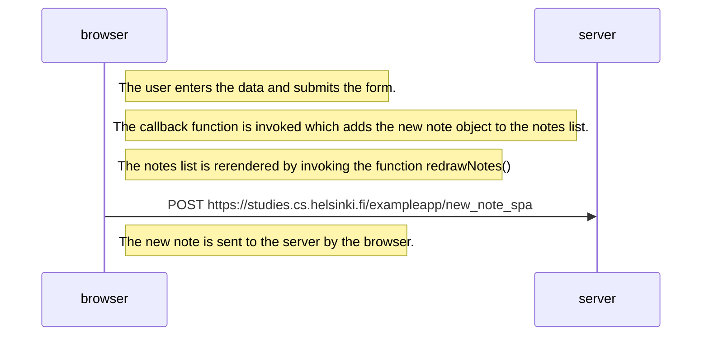

```mermaid
sequenceDiagram

    Participant browser
    Participant server

    Note right of browser: The user enters the data and submits the form.
    Note right of browser: The callback function is invoked which adds the new note object to the notes list.
    Note right of browser: The notes list is rerendered by invoking the function redrawNotes()
    browser->>server: POST https://studies.cs.helsinki.fi/exampleapp/new_note_spa
    Note right of browser: The new note is sent to the server by the browser.
```

