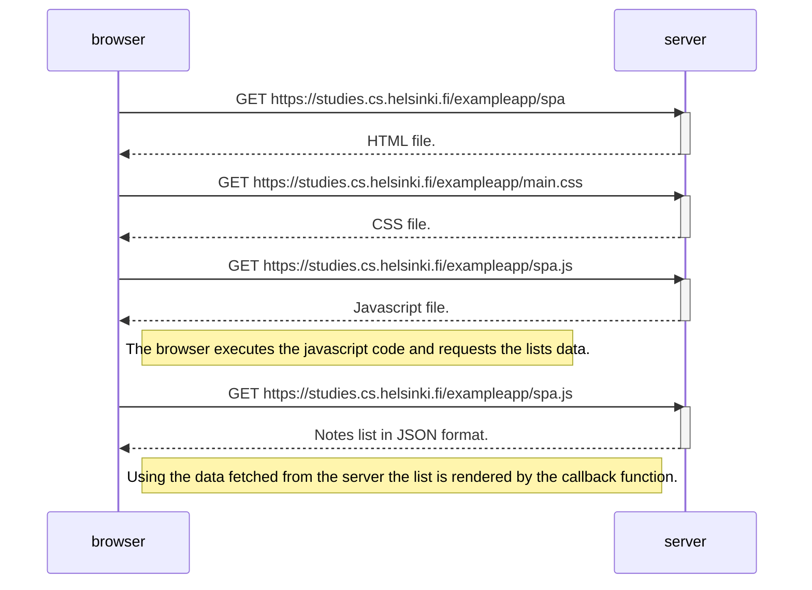

```mermaid
sequenceDiagram
    Participant browser
    Participant server

    browser->>server: GET https://studies.cs.helsinki.fi/exampleapp/spa
    activate server
    server-->>browser: HTML file.
    deactivate server

    browser->>server: GET https://studies.cs.helsinki.fi/exampleapp/main.css
    activate server
    server-->>browser: CSS file.
    deactivate server

    browser->>server: GET https://studies.cs.helsinki.fi/exampleapp/spa.js
    activate server
    server-->>browser: Javascript file.
    deactivate server
    Note right of browser: The browser executes the javascript code and requests the lists data.

    browser->>server: GET https://studies.cs.helsinki.fi/exampleapp/spa.js
    activate server
    server-->>browser: Notes list in JSON format.
    deactivate server
    Note right of browser: Using the data fetched from the server the list is rendered by the callback function.
```